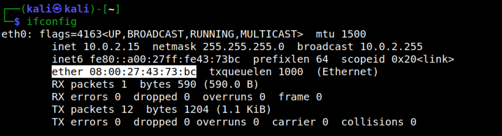
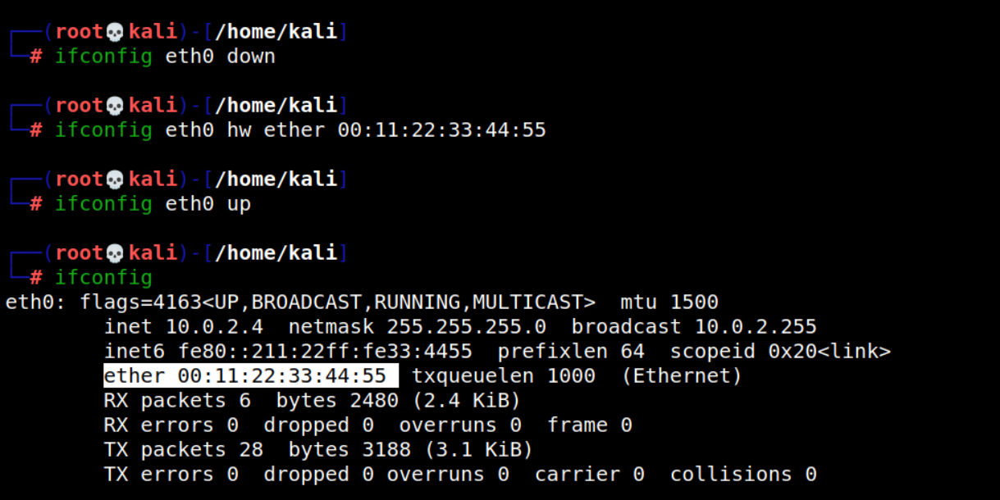
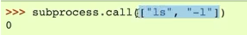
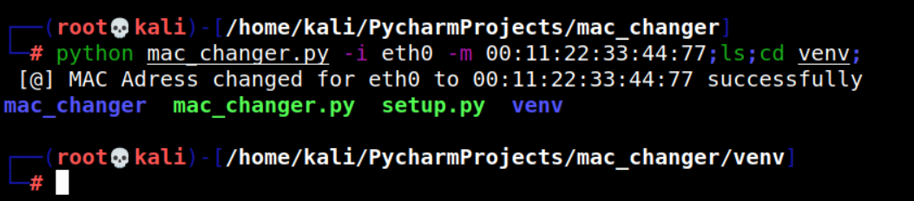

## Project title: Mac Changer
## Project Description: A MAC changer for a fast MAC address change through terminal


MAC (Media Access Control) is a unique identifier that is assigned to a network interface.Mac addresses are physical addresses, they are "set in stone", burnt into the network interface by the manufacturer.
MAC addresses are used for local communication.
For checking the MAC Adress, we can type ifconfig in a Linux terminal, or ipconfig in a Windows one.


- **eth0** is an interface that represents the wired network that kali is connected to, it's a virtual NAT network
- **ether** is the MAC address, is 6 bytes long

For changing the MAC address, we have to type 3 lines of commands:
``` 
ifconfig eth0 interface down -> to deactivate the network interface
ifconfig eth0 hw 00:11:22:33:44:88 -> setting the new MAC
ifconfig eth0 up -> to activate the network interface
``` 


**Important note 1 -> I can't change the physical MAC address, only the virtual one, which is going to be restored after a system restart**

**Important note 2 -> With a changed MAC address, I have an increased anonimity, I can impersonate other devices and bypass filters**

In this project, I created a Python script to change the MAC address, using only a single command
```
mac_changer.py -i eth0 -m 00:11:22:33:44:55
```
I made use of the subprocess module to execute system commands inside a python script.The documentation can be found here: https://docs.python.org/3/library/subprocess.html
I used the call() function within this module, and I choose the list implementation due to security reasons.



Without a list implementation, I allow the user to input anything, even another command which it could be easily injected into the system.


Using a list, each element is one word, and the space is the delimiter.If I try to hijack the interface variable, and put a command in there, Python will know that this should not be treated as a command and it will try to execute it in the ifconfig command which is going to give us an error

I also made use of the **optparse** module, from which I used the OptionParser() class, respectively the add_option() and parse_args() functions.The documentation can be found here:
https://docs.python.org/3/library/optparse.html?highlight=optparse#module-optparse

This module is usefull for recognizing the user input and for parsing the result.
The **add_option function()** is all the code to run the user input, display the health message, store the values that the user enters.
```
"-i", "--interface" - > are the arguments that it can expect from the users
dest = "interface" -> the name where the value of the interface is going to be stored, this how we are going to retreive the user input, it will be stored under [interface]
help = "interface to change it's mac address" -> a help section
```
The **parse_args()** function is useful for parsing the information introduced by the user.This function returns two values, an argument and an option.The option is the most important one, because it has the network interface's name and the new MAC address.
We can acces these by typing:
```
options.interface
options.new_mac
```
